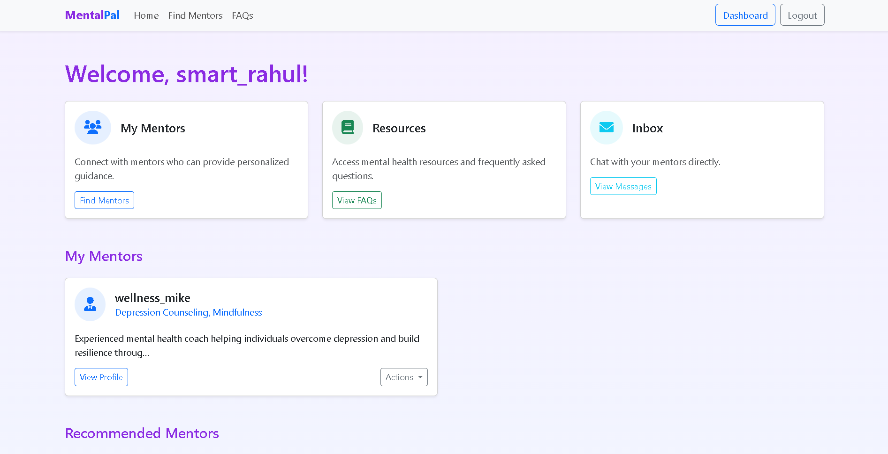
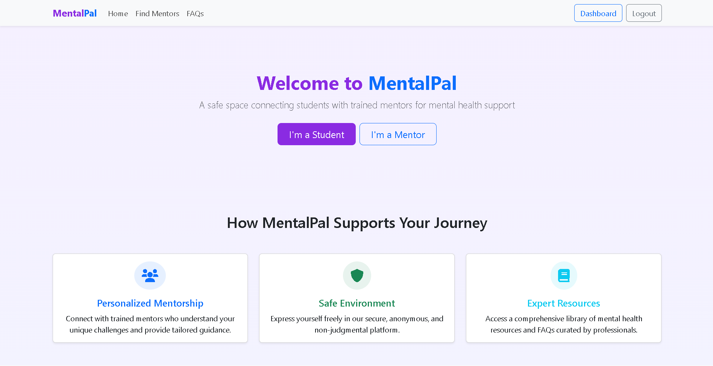

# MentalPal

MentalPal is a web application built with Django that connects students with mentors for mental health support. It includes features like mentor selection, messaging, dashboards, and reviews.






## Prerequisites

- **Python**: 3.13.1 (or compatible version)
- **pip**: Python package manager
- **Virtualenv** (optional but recommended): For isolating dependencies
- **Git**: To clone the repository (if applicable)

## Setup Instructions

### 1. Clone the Repository (if applicable)
If you have a Git repository, clone it. Otherwise, skip to step 2.

```bash
    git clone <repository-url>
    cd mental-pal
```

### 2. Set Up a Virtual Environment
Create and activate a virtual environment to keep dependencies isolated.

On Windows:

```bash
    python -m venv venv
    venv\Scripts\activate
```
On macOS/Linux:

```bash
    python3 -m venv venv
    source venv/bin/activate
```
### 3. Install Dependencies
Install the required Python packages listed in requirements.txt.

```bash
    pip install -r requirements.txt 
```

### 4. Apply Database Migrations
Set up the SQLite database (default) by running migrations.

```bash
    python manage.py makemigrations
    python manage.py migrate
```

### 5. Create a Superuser (Optional)
If you want to have an admin user, you can create one using the following command:

```bash
    python manage.py createsuperuser
```
### 6. Run the Development Server

```bash
    python manage.py runserver
```
Open your browser and go to http://127.0.0.1:8000/ to see the app.
Access the admin panel at http://127.0.0.1:8000/admin/ with your superuser credentials.
### Project Structure

mentalpal/: Django project root
core/: Main app with models, views, templates, etc.
templates/core/: HTML templates
static/: Static files (CSS, JS, images)
db.sqlite3: SQLite database file
requirements.txt: Python dependencies
### Key Features

Student Dashboard: Browse mentors, view mentorships, and chat.
Mentor Dashboard: Manage mentees, view reviews, and chat.
Messaging: Real-time chat between students and mentors.
Mentor Selection: Students can select and reconnect with mentors.

### Troubleshooting
CSRF Errors: Ensure  is in all POST forms.
Database Issues: Delete db.sqlite3 and re-run migrations if needed.
404 Errors: Verify URLs in core/urls.py match view names.


